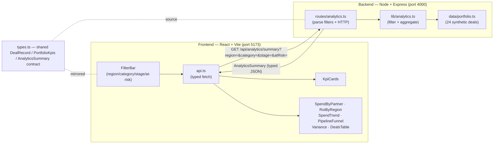
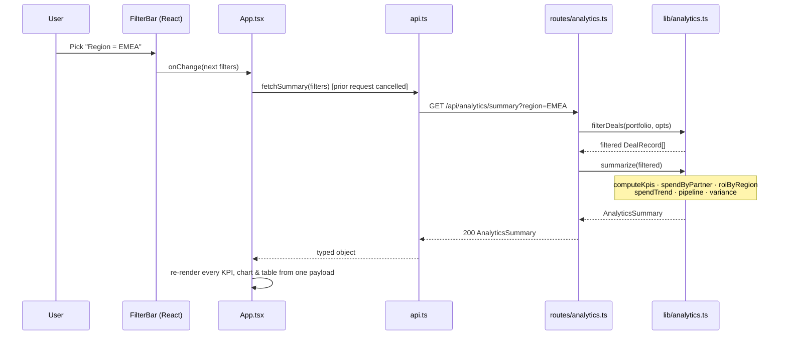
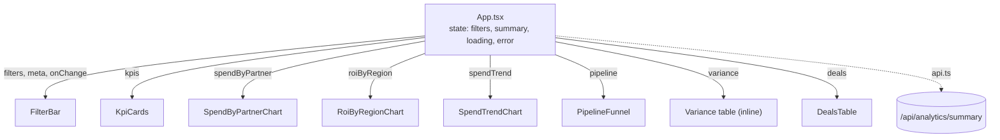

# Partner Incentive Analytics

A full-stack **analytics dashboard** for monitoring a portfolio of partner incentive deals —
incentive spend against budget, spend-weighted ROI, revenue attainment, pipeline by stage, budget
variance, and per-deal performance with risk flags. Every chart and KPI is **filterable** by
region, partner category, deal stage, or at-risk status, with filtering applied server-side so the
whole dashboard stays consistent.

It is the portfolio-monitoring counterpart to a single-deal model: where a deal model answers
*"should we do this deal?"*, this answers *"how is the whole book of deals performing, and where is
the risk?"* — the **performance management, monitoring, and reporting** discipline a deals
organization brings to leadership reviews.

---

## Table of Contents

1. [System Architecture](#system-architecture)
2. [Request Lifecycle](#request-lifecycle)
3. [The Data Model](#the-data-model)
4. [Backend Architecture](#backend-architecture)
5. [The Analytics Engine (the core of the app)](#the-analytics-engine)
6. [Frontend Architecture](#frontend-architecture)
7. [API Reference](#api-reference)
8. [Design Decisions & Tradeoffs](#design-decisions--tradeoffs)
9. [Project Structure](#project-structure)
10. [Running Locally](#running-locally)
11. [Extending the System](#extending-the-system)

---

## System Architecture

A **two-tier client/server** app with a **single typed contract** across the boundary. The
defining architectural choice is that **filtering and all aggregation happen on the server**: the
client sends a filter set as query parameters and receives a fully-computed summary back, so every
KPI, chart, and table on screen is guaranteed to describe the same filtered slice of the portfolio.



**Why this shape:**

- **Server-side aggregation.** If each chart fetched and filtered independently, they could drift
  out of sync (one chart updated, another stale). Computing one `AnalyticsSummary` per request
  makes consistency structural, not something the UI has to coordinate.
- **Pure analytics core.** `analytics.ts` is just functions over arrays — `DealRecord[] →
  AnalyticsSummary`. No Express, no React. Testable and reusable.
- **Contract-first.** `types.ts` is mirrored on both sides; a field change is a compile error on
  both, not a runtime surprise.

---

## Request Lifecycle

What happens when a user changes a filter:



The `useEffect` in `App.tsx` keys on the filter object, so any filter change re-fetches; in-flight
requests are cancelled to prevent a slow earlier response from overwriting a newer one.

---

## The Data Model

A `DealRecord` is one partner deal in the portfolio. The interesting design point is that
**derived fields are computed at load time from raw fields**, so the data can't be internally
inconsistent.

| Field | Meaning |
|-------|---------|
| `id`, `partner`, `category`, `region`, `stage` | Identity and classification. `category ∈ {OEM, ODM, Silicon, Distribution}`, `region ∈ {Americas, EMEA, APAC, Greater China}`, `stage ∈ {Prospecting, Modeling, Negotiation, Approved, Live, Closed}`. |
| `incentiveBudget` | Approved incentive dollars for the deal. |
| `incentiveSpend` | Incentive dollars spent to date. |
| `committedRevenue` | Revenue the partner committed to. |
| `realizedRevenue` | Revenue realized to date. |
| `grossMarginPct` | Gross margin on realized revenue. |
| `startDate` | ISO date (drives the monthly trend). |
| `roiPct` | **Derived.** Margin generated vs. incentive spent. |
| `atRisk` | **Derived.** Over budget, under-delivering, or negative ROI. |

In `data/portfolio.ts`, `roiPct` and `atRisk` are not hand-typed — they're computed from the raw
inputs when the module loads:

```
roiPct = (realizedRevenue × grossMarginPct/100 − incentiveSpend) / incentiveSpend × 100

atRisk = incentiveSpend > incentiveBudget                              (over budget)
       OR (stage ∈ {Live, Closed} AND realizedRevenue < 0.5 × committedRevenue)  (under-delivering)
       OR roiPct < 0                                                   (losing money)
```

This means you can edit a deal's raw numbers and the ROI and risk flag stay correct automatically.

---

## Backend Architecture

A layered Express app, same philosophy as a well-structured service: transport is thin, logic is
pure, data is isolated.

```
backend/src/
├── server.ts             HTTP bootstrap: CORS, JSON, route mounting, health check
├── routes/analytics.ts   Parses query-param filters; delegates to the engine
├── lib/analytics.ts      PURE engine — filtering + every aggregation
├── data/portfolio.ts     24 synthetic deals; derives roiPct + atRisk at load
└── types.ts              Shared contract
```

**`server.ts`** — `cors()` + `express.json()`, `GET /api/health`, mounts the analytics router at
`/api/analytics`, listens on `PORT` (default 4000).

**`routes/analytics.ts`** — exposes three endpoints (`/meta`, `/summary`, `/deals`). It reads the
optional `region`, `category`, `stage`, and `atRisk` query parameters into a `FilterOpts` object
and hands them to the engine. It contains **no aggregation logic** — purely transport.

**`lib/analytics.ts`** — the pure engine (below).

---

## The Analytics Engine

The substance of the project. All of `lib/analytics.ts` is pure functions over a `DealRecord[]`.

### Filtering (`filterDeals`)

Applies the active filter set; `"All"` (or absent) means no constraint on that dimension; `atRisk`
narrows to flagged deals. Everything downstream operates on the filtered list, which is why the
whole dashboard moves together.

### Portfolio KPIs (`computeKpis`)

```
totalBudget          = Σ incentiveBudget
totalSpend           = Σ incentiveSpend
budgetUtilizationPct = totalSpend / totalBudget × 100
committedRevenue     = Σ committedRevenue
realizedRevenue      = Σ realizedRevenue
revenueAttainmentPct = realizedRevenue / committedRevenue × 100
activeDeals          = count(stage ∈ {Approved, Live})
atRiskDeals          = count(atRisk)
```

### Spend-weighted ROI (`weightedRoi`) — the key metric

A simple average of deal ROIs would let a tiny $50K deal swing the portfolio number as much as a
$3M deal. Instead ROI is weighted by incentive spend, so it reflects where the money actually went:

```
weightedAvgRoiPct = Σ (roiPctᵢ × incentiveSpendᵢ) / Σ incentiveSpendᵢ      (deals with spend > 0)
```

The same weighting is applied **within each region** for the ROI-by-region chart.

### Spend by partner (`spendByPartner`)

Groups budget and spend by partner, computes per-partner utilization, sorts by spend descending —
"where are the incentive dollars going."

### Spend trend (`spendTrend`)

Buckets incentive spend by `startDate` month (`YYYY-MM`), sorts chronologically, and accumulates a
running total — giving both the monthly bars and the cumulative line on the trend chart.

### Pipeline (`pipeline`)

Counts deals and sums committed revenue per stage, in fixed funnel order
(Prospecting → Modeling → Negotiation → Approved → Live → Closed).

### Variance (`variance`)

Per deal: `variance = budget − spend` and `variancePct = variance / budget × 100`, sorted
most-over-budget first. Negative variance = spend has exceeded the approved budget (a reporting
red flag).

### Composition (`summarize`)

`summarize(deals)` runs all of the above once and returns a single `AnalyticsSummary`. The route
calls `summarize(filterDeals(portfolio, opts))` — filter first, then aggregate.

---

## Frontend Architecture

A presentational React tree; `App.tsx` owns the small state surface (filters, the fetched summary,
loading/error), every child renders from props.



**State flow:**

1. On mount, `App` fetches `/meta` (to populate the filter dropdowns) and `/summary` with the
   default (unfiltered) filters.
2. Any change in `FilterBar` updates the `filters` object in `App`.
3. A `useEffect` keyed on `filters` re-fetches the summary (cancelling any in-flight request).
4. One `AnalyticsSummary` flows down to every visual at once — so they never disagree.
5. The empty case (filters match no deals) is handled explicitly with a "no deals match" message.

**Component responsibilities:**

| Component | Responsibility |
|-----------|----------------|
| `FilterBar` | Region / category / stage selects + an at-risk checkbox + reset. Drives the whole dashboard. |
| `KpiCards` | Eight headline metrics; utilization and ROI are color-coded by threshold. |
| `SpendByPartnerChart` | Horizontal Recharts grouped bars — budget vs. spend, top partners. |
| `RoiByRegionChart` | Recharts column chart, bars colored by ROI sign, value labels. |
| `SpendTrendChart` | Recharts `ComposedChart` — monthly spend bars + cumulative area/line. |
| `PipelineFunnel` | Hand-built CSS funnel: bar width scaled to committed revenue per stage. |
| `DealsTable` | Client-side **sortable** table (click any header) with at-risk / on-track pills. |
| `api.ts` | Typed fetch wrappers; serializes filters to query params; reads `VITE_API_URL`. |
| `format.ts` | `money()`, `pct()`, `count()`, `monthLabel()` helpers. |

Charts use **Recharts**; styling is hand-written **plain CSS** (`index.css`, CSS variables) — no
Tailwind, for portability. Sorting in `DealsTable` is local because it's pure presentation and
needs no server round-trip; *filtering* is server-side because it changes the aggregates.

---

## API Reference

Base URL: `http://localhost:4000`

### `GET /api/health`
→ `{ "ok": true, "service": "partner-incentive-analytics" }`

### `GET /api/analytics/meta`
Filter option lists for the dropdowns. → `{ regions[], categories[], stages[] }`

### `GET /api/analytics/summary`
**Query (all optional):** `region`, `category`, `stage`, `atRisk=true`.
**Returns:** the full `AnalyticsSummary` = `{ kpis, spendByPartner, roiByRegion, spendTrend,
pipeline, variance, deals }`, computed over the filtered portfolio.

### `GET /api/analytics/deals`
Same filters; returns `{ deals }` only (no aggregates).

---

## Design Decisions & Tradeoffs

- **Server-side filtering + aggregation.** The single most important choice. One request → one
  consistent summary; the UI never has to reconcile independently-filtered charts.
- **Derived fields computed from raw data.** `roiPct` and `atRisk` are calculated, not stored, so
  the sample portfolio is internally consistent and editable without manual recomputation.
- **Spend-weighted ROI.** Reflects where incentive dollars actually went, instead of letting tiny
  deals distort the portfolio figure.
- **Local sort, remote filter.** Sorting doesn't change *which* deals are shown, so it's done in the
  browser; filtering changes the aggregates, so it's done on the server. The split matches what each
  operation actually affects.
- **Plain CSS, no Tailwind; no database.** Same rationale as the deal modeler — minimal
  dependencies, trivial to run, focus on the analytics rather than infrastructure.
- **Contract duplicated, not shared-packaged.** Frontend and backend build independently; the cost
  is keeping two `types.ts` in sync.

---

## Project Structure

```
partner-incentive-analytics/
├── README.md
├── .gitignore
├── backend/
│   ├── package.json             express, cors, tsx, typescript
│   ├── tsconfig.json            CommonJS, ES2021, strict
│   └── src/
│       ├── server.ts            Express bootstrap (port 4000)
│       ├── types.ts             Shared contract
│       ├── routes/analytics.ts  /meta, /summary, /deals + filter parsing
│       ├── lib/analytics.ts     Pure engine: filterDeals, computeKpis, spendByPartner,
│       │                        roiByRegion, spendTrend, pipeline, variance, summarize
│       └── data/portfolio.ts    24 synthetic deals; derives roiPct + atRisk
└── frontend/
    ├── package.json             react, recharts, vite
    ├── vite.config.ts           dev server :5173, proxies /api → :4000
    ├── index.html
    └── src/
        ├── main.tsx             React entry
        ├── App.tsx              State, filter effect, dashboard layout
        ├── api.ts               Typed fetch wrappers + query serialization
        ├── types.ts             Shared contract (mirror)
        ├── format.ts            Display formatters
        ├── index.css            Theme (CSS variables)
        └── components/
            ├── FilterBar.tsx
            ├── KpiCards.tsx
            ├── SpendByPartnerChart.tsx
            ├── RoiByRegionChart.tsx
            ├── SpendTrendChart.tsx
            ├── PipelineFunnel.tsx
            └── DealsTable.tsx
```

---

## Running Locally

Two terminals.

**Backend** (http://localhost:4000):

```bash
cd backend
npm install
npm run dev      # tsx watch
```

**Frontend** (http://localhost:5173):

```bash
cd frontend
npm install
npm run dev
```

Vite proxies `/api` to the backend, so no extra config is needed. To point the frontend at a
deployed API, set `VITE_API_URL` at build time. Build for production with `npm run build` in each
folder.

---

## Extending the System

- **Add a KPI:** extend `PortfolioKpis` in both `types.ts`, compute it in `computeKpis`, render a
  card in `KpiCards`.
- **Add a filter dimension:** add the field to `FilterOpts` + `filterDeals`, expose it in
  `routes/analytics.ts`, and add a control to `FilterBar`.
- **Swap in a real data source:** replace `data/portfolio.ts` with a DB/warehouse query that returns
  `DealRecord[]`; every aggregation works unchanged because they only depend on the array shape.
- **Add a chart:** add an aggregation to `analytics.ts`, include it in `summarize`/`AnalyticsSummary`,
  and render a new component.

> All partners, figures, and dates in the sample portfolio are fictional and for demonstration only.
